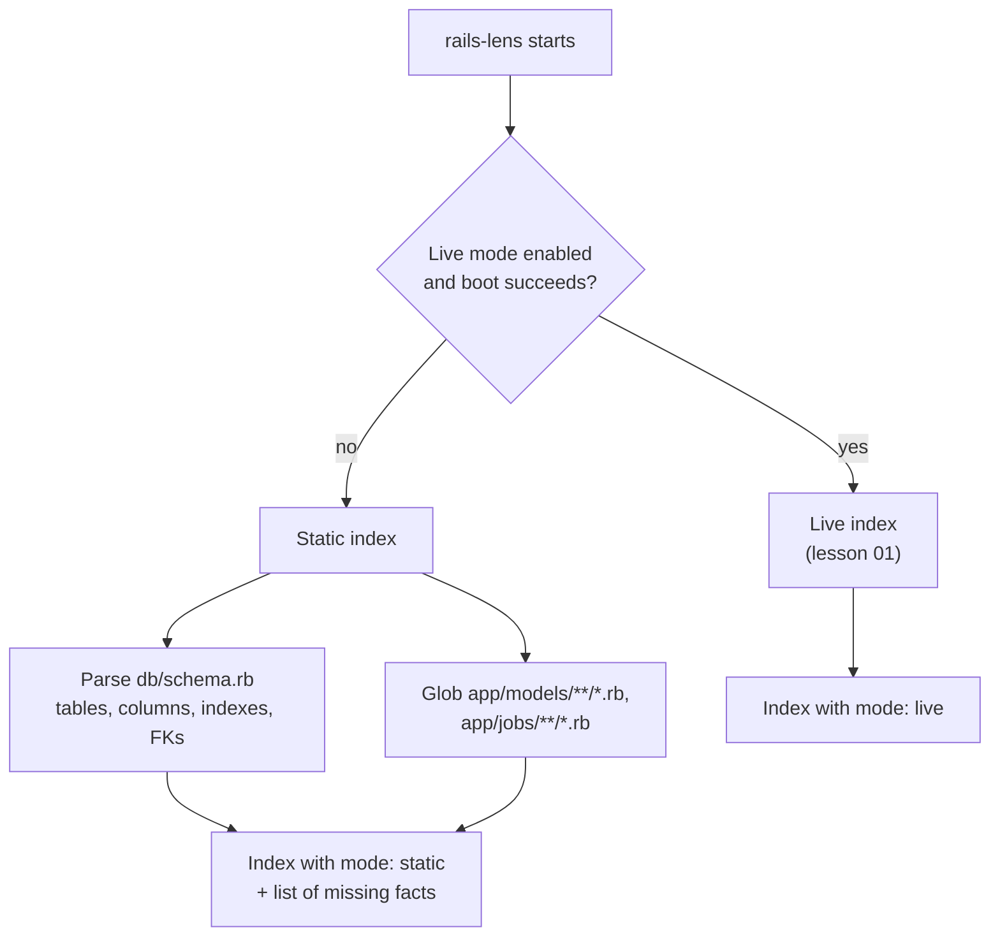

# 02 · Static mode: parsing `schema.rb` without booting Rails

<!-- nav:top -->
[Course home](../../README.md) › [Step 8 plan](../../steps/08-ai-tool-mvp.md) › [Step 8 lessons](00-start-here.md) · [Glossary](../../GLOSSARY.md)
<!-- nav:end -->

## 1. In one sentence

**Static mode** builds a smaller codebase index by **reading files** (mainly `db/schema.rb` and the list of files under `app/`) instead of booting the app, so `rails-lens` still works when the app cannot start.

## 2. Why it exists

Live introspection (lesson 01) is accurate, but booting a Rails app often fails on a developer's laptop or in CI:

- the database is not running,
- credentials (`config/master.key`) are missing,
- a native gem does not compile,
- an initializer needs a service (Redis, an external API).

A tool that crashes in those cases is a tool people uninstall. Static mode gives **partial but reliable** answers (tables, columns, indexes, foreign keys, which model and job files exist) and tells the user clearly which facts need live mode.

## 3. Rails analogy

`db/schema.rb` is Ruby code, but it is **generated** by Rails in a very regular format (`create_table`, `t.string`, `t.index`, `add_foreign_key`). You treat it like a data file, much as `bundler` treats `Gemfile.lock`: a machine-written file with a stable shape that you can parse line by line without executing it.

Where the analogy breaks: apps that use `config.active_record.schema_format = :sql` have `db/structure.sql` instead. That is plain SQL (`CREATE TABLE ...`), which needs a different parser. Handle `schema.rb` first and report "structure.sql not supported yet" for the rest.

## 4. How it works



What each mode can answer:

| Fact | Live mode | Static mode |
|---|---|---|
| Tables, columns, types, null | ✅ | ✅ from `schema.rb` |
| Indexes, unique indexes, foreign keys | ✅ (columns only; add indexes if you need them) | ✅ from `schema.rb` |
| Model and job file list | ✅ | ✅ by globbing `app/` |
| Associations, validations, callbacks | ✅ exact | ❌ (only guesses from foreign keys) |
| Routes | ✅ | ❌ |

**Every tool response includes the mode**, so the model (and the user) know how much to trust it:

```json
{"mode": "static", "missing": ["associations", "validations", "callbacks", "routes"], "table": "orders", "columns": [...]}
```

### Parsing line by line

The generated `schema.rb` looks like this (from a Rails 8.1 app):

```ruby
ActiveRecord::Schema[8.1].define(version: 2026_09_28_093627) do
  enable_extension "pg_catalog.plpgsql"

  create_table "orders", force: :cascade do |t|
    t.bigint "customer_id", null: false
    t.string "status"
    t.integer "total_cents"
    t.datetime "created_at", null: false
    t.datetime "updated_at", null: false
    t.index ["customer_id"], name: "index_orders_on_customer_id"
  end

  add_foreign_key "orders", "customers"
end
```

Four regular expressions cover it:

| Line | Pattern | Captures |
|---|---|---|
| `create_table "orders", force: :cascade do \|t\|` | `create_table "(name)"(opts) do \|t\|` | table name; `id: false` in options means no `id` column |
| `t.string "status"` | `t.(type) "(name)"(opts)` | column type, name, and `null: false` in options |
| `t.index ["customer_id"], name: ...` | `t.index [(cols)](opts)` | indexed columns, `unique: true` |
| `add_foreign_key "orders", "customers"` | `add_foreign_key "(from)", "(to)"` | foreign key |

Order matters: check for `t.index` **before** the generic `t.(type)` pattern, because `t.index [...]` would otherwise look like a column called `index`.

## 5. Minimal working example

Create `schema_parser.py`:

```python
import re
from dataclasses import dataclass, field
from pathlib import Path

CREATE_TABLE = re.compile(r'^\s*create_table "(?P<table>[^"]+)"(?P<opts>.*) do \|t\|')
COLUMN = re.compile(r'^\s*t\.(?P<type>\w+) "(?P<name>[^"]+)"(?P<opts>.*)$')
INDEX = re.compile(r'^\s*t\.index \[(?P<cols>[^\]]*)\](?P<opts>.*)$')
FOREIGN_KEY = re.compile(r'^\s*add_foreign_key "(?P<from>[^"]+)", "(?P<to>[^"]+)"')


@dataclass
class Column:
    name: str
    type: str
    null: bool = True


@dataclass
class Table:
    name: str
    columns: list[Column] = field(default_factory=list)
    indexes: list[dict] = field(default_factory=list)
    foreign_keys: list[str] = field(default_factory=list)  # referenced tables


def parse_schema(text: str) -> dict[str, Table]:
    tables: dict[str, Table] = {}
    current: Table | None = None
    for line in text.splitlines():
        if m := CREATE_TABLE.match(line):
            current = Table(m["table"])
            tables[current.name] = current
            if "id: false" not in m["opts"]:
                current.columns.append(Column("id", "primary_key", null=False))
        elif current and (m := INDEX.match(line)):
            cols = re.findall(r'"([^"]+)"', m["cols"])
            current.indexes.append({"columns": cols, "unique": "unique: true" in m["opts"]})
        elif current and (m := COLUMN.match(line)):
            current.columns.append(Column(m["name"], m["type"], null="null: false" not in m["opts"]))
        elif line.strip() == "end":
            current = None
        elif m := FOREIGN_KEY.match(line):
            tables[m["from"]].foreign_keys.append(m["to"])
    return tables


if __name__ == "__main__":
    import sys

    tables = parse_schema(Path(sys.argv[1]).read_text())
    orders = tables["orders"]
    print("tables:", sorted(tables))
    print("orders columns:", [(c.name, c.type, c.null) for c in orders.columns])
    print("orders indexes:", orders.indexes)
    print("orders foreign keys:", orders.foreign_keys)
```

A few Python notes, if they are new to you:

- `m := CREATE_TABLE.match(line)` is the **walrus operator**: assign and test in one expression (like `if (m = line.match(...))` in Ruby).
- `m["table"]` reads a **named group** `(?P<table>...)` from the match.
- `@dataclass` generates `__init__` and `__repr__` (like a Ruby `Struct` with keyword arguments).

Run it on `shop-lab`'s schema:

```bash
uv run python schema_parser.py ~/code/shop-lab/db/schema.rb
```

Output (tested against a Rails 8.1 schema):

```
tables: ['customers', 'line_items', 'orders', 'products']
orders columns: [('id', 'primary_key', False), ('customer_id', 'bigint', False), ('status', 'string', True), ('total_cents', 'integer', True), ('created_at', 'datetime', False), ('updated_at', 'datetime', False)]
orders indexes: [{'columns': ['customer_id'], 'unique': False}]
orders foreign keys: ['customers']
```

Write tests for the cases that break naive parsers: a table with `id: false`, a `uuid` primary key (`id: :uuid`), a multi-column index, a column with a default containing a comma or quotes, and `t.references`. Keep a few real `schema.rb` files from open-source apps in `tests/fixtures/`.

## 6. Key terms

- **Static analysis**: learning about code by reading files, without running them.
- **Live mode / static mode**: index built by booting the app vs by parsing files.
- **`schema.rb` / `structure.sql`**: Rails' Ruby and SQL formats for the database schema.
- **Regular expression (regex), named group**: a text pattern; `(?P<name>...)` captures a named part.
- **Graceful degradation**: giving partial, clearly labelled answers instead of failing.

## 7. Common mistakes

- **Executing `schema.rb`** to read it. Parse it as text; never `eval` project files.
- **Checking the column pattern before the index pattern**, so `t.index` becomes a column.
- **Silently returning partial data.** Always include `mode` and `missing` in tool output.
- **Assuming every app has `schema.rb`.** Detect `structure.sql` and say it is not supported yet.
- **No tests with real schemas.** Generated files from different Rails versions differ slightly (for example `ActiveRecord::Schema[8.1]` vs older headers).

## 8. Check your understanding

1. Name three reasons live mode can fail on a developer's machine.
2. Which facts can static mode not provide, and how does the tool tell the model?
3. Why must the `t.index` pattern be checked before the generic column pattern?
4. What would you do for an app that uses `structure.sql`?
5. Why is it safe to parse `schema.rb` but not to `eval` it?

<details>
<summary>Answers</summary>

1. Any three of: the database is not running, missing credentials/master key, a gem fails to load or compile, an initializer needs an unavailable service, wrong Ruby version.
2. Associations, validations, callbacks and routes. Every response includes `"mode": "static"` and a `missing` list.
3. `t.index ["col"]` also matches `t.(\w+) ...`-style patterns; checking the specific pattern first avoids treating `index` as a column type.
4. Detect it and report clearly that static mode does not support it yet (or write a small SQL parser for `CREATE TABLE`, as a stretch goal); live mode still works.
5. Parsing only reads text; `eval` would run arbitrary Ruby from the repository, which could do anything.

</details>

## 9. Go deeper (optional)

- Rails Guides: [Active Record Migrations → Schema Dumping and You](https://guides.rubyonrails.org/active_record_migrations.html#schema-dumping-and-you).
- Python docs: [`re` module](https://docs.python.org/3/library/re.html) (named groups) and [`dataclasses`](https://docs.python.org/3/library/dataclasses.html).

<!-- nav:bottom -->

---

[← 01 · Rails introspection with `bin/rails runner`](01-rails-introspection-with-rails-runner.md) · [Step 8 lessons](00-start-here.md) · [03 · Building the rails-lens MCP server →](03-building-the-rails-lens-server.md)
<!-- nav:end -->
