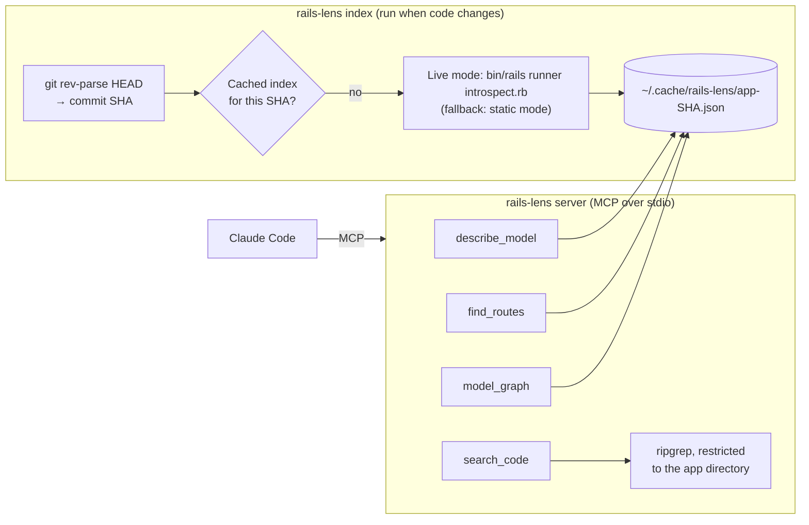

# 03 · Building the rails-lens MCP server

<!-- nav:top -->
[Course home](../../README.md) › [Step 8 plan](../../steps/08-ai-tool-mvp.md) › [Step 8 lessons](00-start-here.md) · [Glossary](../../GLOSSARY.md)
<!-- nav:end -->

## 1. In one sentence

`rails-lens` is an MCP server with a handful of **read-only tools** (`describe_model`, `find_routes`, `model_graph`, `search_code`) that answer from a cached **codebase index** of a Rails app, so an AI assistant gets precise facts in one tool call instead of grepping around.

## 2. Why it exists

You have the pieces: lesson 01 builds a live index, lesson 02 a static one, and Step 7 taught you MCP servers. This lesson assembles them into a tool someone else can run, with the engineering that makes it trustworthy:

- **Speed:** booting Rails takes seconds. The index is built **once per Git commit** and cached, so tool calls take milliseconds.
- **Precision:** each tool returns exactly the facts needed, in a compact form, with file paths the model can cite.
- **Safety:** the server is read-only, cannot read files outside the app, and refuses secret files.

## 3. Rails analogy

The server is to the index what a **read-only API controller** is to a database:

| Rails API | rails-lens |
|---|---|
| Database | The cached index JSON |
| A migration/seed that fills the database | `rails-lens index` (runs lesson 01's script) |
| Controller actions | Tools: `describe_model`, `find_routes`, ... |
| `ActiveRecord::RecordNotFound` → 404 with a helpful message | `ToolError("No model named 'Invoice'. Known models: ...")` |
| Strong parameters / path sanitising | `safe_path()` allowlist |
| Fragment cache keyed by `updated_at` | Index cached by Git commit SHA |

## 4. How it works



### Project layout

```
rails-lens-mcp/
├── pyproject.toml
├── README.md
├── EVALS.md
├── src/rails_lens/
│   ├── __init__.py
│   ├── cli.py            # "rails-lens index" and "rails-lens serve" (lesson 05)
│   ├── introspect.rb     # lesson 01, shipped inside the package
│   ├── live.py           # build_live_index() from lesson 01
│   ├── static.py         # parse_schema() from lesson 02
│   └── server.py         # the MCP server (this lesson)
├── tests/
│   ├── fixtures/rails_index.json
│   └── test_server.py
└── evals/                # lesson 04
```

To keep this lesson runnable in one folder, the example below uses a single `rails_lens.py`; in the real project, split it as shown.

### Tool design decisions

| Tool | Returns | Why this shape |
|---|---|---|
| `describe_model(name)` | Table, columns as `"name:type NOT NULL"` strings, associations, validations, callbacks, file | One call answers most model questions; column strings are compact (fewer tokens) |
| `find_routes(query)` | Matching routes (verb, path, `controller#action`, name), max 30 | Substring match on path, action or name covers "orders", "refund", "line_items#create" |
| `model_graph(name)` | A Mermaid class diagram of direct associations | Useful in answers and docs; shows the model's neighbourhood at a glance |
| `search_code(pattern, path)` | `file:line:text` matches from ripgrep, max 30 | For facts the index does not have (a constant's value, where a method is called) |

Errors are `ToolError`s with **helpful messages**: an unknown model lists the known ones, so the model can correct itself in the next call.

### Safety rules in code

- **Allowlist paths:** `safe_path()` resolves the requested path and refuses anything outside the app directory (`../../etc`) or named like a secret (`.env`, `master.key`, `credentials.yml.enc`, `database.yml`).
- **Exclude secrets from search:** ripgrep gets `--glob '!**/.env'`-style excludes for the same names.
- **Limits:** at most 30 results, 5 matches per file, a 20-second timeout.
- **Fixed-string search:** `--fixed-strings` treats the pattern as plain text, so a model cannot send a pathological regular expression.
- **No write tools at all.**

## 5. Minimal working example

Prerequisites: `uv add "mcp[cli]" pytest` in your project, and [ripgrep](https://github.com/BurntSushi/ripgrep) installed (`brew install ripgrep` or `apt install ripgrep`).

`rails_lens.py`:

```python
import json
import os
import subprocess
from pathlib import Path
from typing import Any

from mcp.server import MCPServer
from mcp.server.mcpserver.exceptions import ToolError

APP = Path(os.environ.get("RAILS_LENS_APP", ".")).resolve()
CACHE_DIR = Path(os.environ.get("RAILS_LENS_CACHE", Path.home() / ".cache" / "rails-lens"))
SECRET_NAMES = {".env", "master.key", "credentials.yml.enc", "secrets.yml", "database.yml"}
MAX_MATCHES = 30

mcp = MCPServer("rails-lens")


# --- The index (built once per Git commit, then cached) ----------------------
def git_sha(app: Path) -> str:
    result = subprocess.run(["git", "rev-parse", "HEAD"], cwd=app, capture_output=True, text=True, check=True)
    return result.stdout.strip()


def load_index() -> dict:
    cached = CACHE_DIR / f"{APP.name}-{git_sha(APP)}.json"
    if not cached.exists():
        raise ToolError(f"No index for this commit yet. Run: rails-lens index --app {APP}")
    return json.loads(cached.read_text())


def find_model(index: dict, name: str) -> dict:
    for model in index["models"]:
        if model["name"].lower() == name.lower() or model["table"] == name.lower():
            return model
    names = ", ".join(m["name"] for m in index["models"])
    raise ToolError(f"No model named {name!r}. Known models: {names}")


# --- Tools --------------------------------------------------------------------
@mcp.tool()
def describe_model(name: str) -> dict[str, Any]:
    """Describe an Active Record model: table, columns, associations, validations, callbacks and file.

    Use this before changing or explaining a model. `name` is the class name (Order) or table (orders).
    """
    model = find_model(load_index(), name)
    return model | {"columns": [f"{c['name']}:{c['type']}{'' if c['null'] else ' NOT NULL'}"
                                for c in model["columns"]]}


@mcp.tool()
def find_routes(query: str) -> list[dict[str, Any]]:
    """Find routes whose path, controller#action or route name contains `query` (e.g. "orders")."""
    q = query.lower()
    routes = [r for r in load_index()["routes"]
              if q in r["path"].lower() or q in r["action"].lower() or q in (r["name"] or "")]
    return routes[:MAX_MATCHES]


@mcp.tool()
def model_graph(name: str) -> str:
    """Return a Mermaid diagram of a model and its direct associations."""
    model = find_model(load_index(), name)
    lines = ["classDiagram"]
    arrows = {"belongs_to": "-->", "has_many": '"1" --> "*"', "has_one": '"1" --> "1"'}
    for a in model["associations"]:
        arrow = arrows.get(a["macro"], "-->")
        lines.append(f"  {model['name']} {arrow} {a['class_name']} : {a['name']}")
    return "\n".join(lines)


def safe_path(relative: str) -> Path:
    """Resolve a path inside the app and refuse anything outside it or secret."""
    path = (APP / relative).resolve()
    if not path.is_relative_to(APP):
        raise ToolError("Path is outside the application directory.")
    if path.name in SECRET_NAMES or ".env" in path.name:
        raise ToolError(f"Refusing to read secret file {path.name}.")
    return path


@mcp.tool()
def search_code(pattern: str, path: str = "app") -> list[str]:
    """Search the app's code with ripgrep (fixed string, case-insensitive). Returns file:line:text matches."""
    target = safe_path(path)
    excludes = [arg for name in SECRET_NAMES for arg in ("--glob", f"!**/{name}")]
    result = subprocess.run(
        ["rg", "--fixed-strings", "--ignore-case", "--line-number", "--max-count", "5", *excludes,
         pattern, str(target)],
        capture_output=True, text=True, timeout=20,
    )
    if result.returncode not in (0, 1):  # 1 means "no matches"
        raise ToolError(f"Search failed: {result.stderr.strip()[:200]}")
    lines = [line.removeprefix(f"{APP}/") for line in result.stdout.splitlines()]
    return lines[:MAX_MATCHES]


if __name__ == "__main__":
    mcp.run()
```

Notes on the Python you may not know yet:

- `model | {...}` merges two dicts (like Ruby's `merge`), with the right side winning.
- `path.is_relative_to(APP)` is `True` only if `path` is inside `APP` (Python 3.9+).
- `[arg for name in SECRET_NAMES for arg in (...)]` is a nested comprehension: for each name it adds two items, `--glob` and the pattern.
- The return type `dict[str, Any]` matters: with it, the MCP SDK returns **structured content** (JSON the client can read as a dict). With a bare `dict`, you only get text.

`test_rails_lens.py`, next to `rails_lens.py` (tests in memory, against a fixture index created by lesson 01's script):

```python
import shutil
import subprocess
from pathlib import Path

import pytest
from mcp import Client

FIXTURE = Path(__file__).parent / "fixtures" / "rails_index.json"


@pytest.fixture
def lens(tmp_path, monkeypatch):
    app = tmp_path / "shop"
    (app / "app" / "models").mkdir(parents=True)
    (app / "app" / "models" / "order.rb").write_text("class Order < ApplicationRecord\n  STATUSES = %w[pending paid]\nend\n")
    (app / ".env").write_text("SECRET_KEY_BASE=abc\n")
    subprocess.run(["git", "init", "-q"], cwd=app, check=True)
    subprocess.run(["git", "-c", "user.email=t@t", "-c", "user.name=t", "commit", "-q", "--allow-empty", "-m", "x"], cwd=app, check=True)
    monkeypatch.setenv("RAILS_LENS_APP", str(app))
    monkeypatch.setenv("RAILS_LENS_CACHE", str(tmp_path / "cache"))
    import importlib
    import rails_lens
    importlib.reload(rails_lens)  # re-read the environment variables
    sha = rails_lens.git_sha(app)
    (tmp_path / "cache").mkdir()
    shutil.copy(FIXTURE, tmp_path / "cache" / f"shop-{sha}.json")
    return rails_lens.mcp


@pytest.mark.anyio
async def test_describe_model_includes_implicit_validation(lens):
    async with Client(lens) as client:
        result = await client.call_tool("describe_model", {"name": "orders"})
    model = result.structured_content
    assert {"kind": "presence", "attributes": ["customer"], "options": {"message": "required"}} in model["validations"]
    assert "customer_id:integer NOT NULL" in model["columns"]


@pytest.mark.anyio
async def test_unknown_model_lists_known_ones(lens):
    async with Client(lens) as client:
        result = await client.call_tool("describe_model", {"name": "Invoice"})
    assert result.is_error and "Known models: Customer, LineItem, Order, Product" in result.content[0].text


@pytest.mark.anyio
async def test_search_code_never_reads_secrets(lens):
    async with Client(lens) as client:
        hits = await client.call_tool("search_code", {"pattern": "SECRET_KEY_BASE", "path": "."})
        env = await client.call_tool("search_code", {"pattern": "x", "path": ".env"})
        outside = await client.call_tool("search_code", {"pattern": "x", "path": "../../etc"})
    assert hits.structured_content["result"] == []
    assert env.is_error and outside.is_error


@pytest.fixture
def anyio_backend():
    return "asyncio"
```

Run the tests:

```bash
mkdir -p fixtures && cp /tmp/rails_index.json fixtures/rails_index.json   # the index from lesson 01
uv run pytest -q
```

```
...                                                                      [100%]
3 passed
```

Try it by hand against `shop-lab`. First put an index in the cache (lesson 05 turns this into `rails-lens index`), then call the tools over stdio with a small client:

```bash
cd ~/code/shop-lab
bin/rails runner ~/code/rails-lens-mcp/introspect.rb ~/.cache/rails-lens/shop-lab-$(git rev-parse HEAD).json
```

Tested output of `model_graph("Order")`, `find_routes("line_items")` and `search_code("send_receipt")` on the lesson 01 test app:

```
classDiagram
  Order --> Customer : customer
  Order "1" --> "*" LineItem : line_items
  Order "1" --> "*" Product : products
{'result': [{'verb': 'POST', 'path': '/orders/:order_id/line_items', 'action': 'line_items#create', 'name': 'order_line_items'}, {'verb': 'DELETE', 'path': '/orders/:order_id/line_items/:id', 'action': 'line_items#destroy', 'name': 'order_line_item'}]}
{'result': ['app/models/order.rb:12:  after_create_commit :send_receipt', 'app/models/order.rb:22:  def send_receipt']}
```

Connect it to Claude Code (from the Rails app's directory):

```bash
claude mcp add rails-lens --env RAILS_LENS_APP="$PWD" -- uv run --directory ~/code/rails-lens-mcp python rails_lens.py
```

Then ask: "Using rails-lens, what happens when an Order is created?"

## 6. Key terms

- **Codebase index**: the cached JSON snapshot the tools answer from.
- **Cache key**: the Git commit SHA; a new commit means a new index.
- **Path allowlist**: only paths inside the app, never secret files.
- **Structured content**: JSON tool output a client can parse (needs a typed return like `dict[str, Any]`).
- **ripgrep (`rg`)**: a fast code search tool; `--fixed-strings` disables regex.
- **Fixture**: a saved input file used by tests (here, a real index JSON).

## 7. Common mistakes

- **Booting Rails on every tool call.** Build the index once per commit.
- **Serving a stale index silently.** Key the cache by commit SHA and tell the user how to rebuild when it is missing.
- **Returning the whole index** from one tool. Keep outputs small and specific.
- **String-prefix path checks** (`str(path).startswith(str(APP))`): `/app-evil` starts with `/app`. Use `resolve()` + `is_relative_to()`.
- **Forgetting that search output can contain secrets** from files you did not think of. Exclude by name and review what the tool returns on a real app.
- **Testing only through Claude Code.** Test with the in-memory `Client` and fixtures; it is fast and repeatable in CI.

## 8. Check your understanding

1. Why is the index cached by Git commit SHA rather than by time?
2. What does `safe_path("../../etc/passwd")` do, and which line prevents the attack?
3. Why does an unknown model name return the list of known models?
4. Why does `search_code` use `--fixed-strings`?
5. What would you need to change to support a Rails app with two databases (two abstract base classes)?

<details>
<summary>Answers</summary>

1. The facts only change when the code changes; the SHA identifies exactly which code the index describes, so it is never stale and never rebuilt unnecessarily.
2. It resolves to a path outside the app, and `if not path.is_relative_to(APP)` raises a `ToolError`.
3. So the model can recover in its next call (for example, the user said "invoices" but the model is `Bill`), instead of giving up.
4. It treats the pattern as literal text: no regex errors, and no slow, pathological regular expressions from the model.
5. In `introspect.rb`, collect models from every abstract base class (for example `ActiveRecord::Base.descendants` filtered to concrete models) instead of only `ApplicationRecord.descendants`, and record which database each model uses.

</details>

## 9. Go deeper (optional)

- MCP Python SDK docs: https://py.sdk.modelcontextprotocol.io (tools, structured output, testing).
- ripgrep user guide: https://github.com/BurntSushi/ripgrep/blob/master/GUIDE.md
- Python docs: [`pathlib.Path.resolve` and `is_relative_to`](https://docs.python.org/3/library/pathlib.html).

<!-- nav:bottom -->

---

[← 02 · Static mode: parsing `schema.rb` without booting Rails](02-static-mode-parsing-schema-rb.md) · [Step 8 lessons](00-start-here.md) · [04 · Evaluating your tool: ground truth and A/B evals →](04-evaluating-your-tool.md)
<!-- nav:end -->
