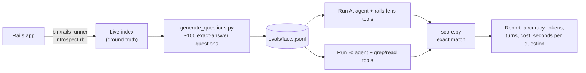

# 04 · Evaluating your tool: ground truth and A/B evals

<!-- nav:top -->
[Course home](../../README.md) › [Step 8 plan](../../steps/08-ai-tool-mvp.md) › [Step 8 lessons](00-start-here.md) · [Glossary](../../GLOSSARY.md)
<!-- nav:end -->

## 1. In one sentence

You prove your tool is useful by running **the same tasks with and without it** (an **A/B eval**) and comparing accuracy, tokens, turns, cost and time, using **ground truth** that, for rails-lens, comes for free from Rails itself.

## 2. Why it exists

"It feels better in Claude Code" will not convince your manager, your teammates or strangers on GitHub. A tool like rails-lens makes three claims that you can measure:

1. **More accurate answers** about the app.
2. **Fewer tokens** (the assistant does not need to grep and read many files).
3. **Fewer turns / less time** to reach the answer.

Each claim needs a **baseline**: the same assistant, same model, same questions, **without** your tool. And each needs **ground truth**: known-correct answers to score against. Step 7 taught you the general method (lessons 11-12); this lesson applies it to a tool you built.

## 3. Rails analogy

An A/B eval is a **benchmark with a control group**, exactly like your Step 1 work:

| Step 1 (performance) | Step 8 (tool quality) |
|---|---|
| Baseline: YJIT off | Baseline: assistant **without** rails-lens (grep + read files only) |
| Change: YJIT on | Change: assistant **with** rails-lens |
| Same endpoints, same load | Same questions, same model, same limits |
| Metrics: req/s, p95, RSS | Metrics: accuracy, tokens, turns, cost, seconds |
| One change at a time | Only the tool set differs between A and B |

## 4. How it works



### Three layers of evals for rails-lens

| Layer | What | Needs a model? | When it runs |
|---|---|---|---|
| **1. Tool contract tests** | For every model in a fixture index, `describe_model` returns all its associations; every route is found by `find_routes`; secret files are refused; static mode columns match live mode columns | No | Every PR (pytest, fast, free) |
| **2. Fact questions (A/B)** | ~100 generated questions per app with exact answers; agent with vs without the tool | Yes | On demand (`workflow_dispatch`) or before a release |
| **3. Real developer tasks** | 15-20 hand-written tasks ("add a refunded status: which files and callbacks are involved?"), graded with deterministic checks (must mention `app/models/order.rb`, `send_receipt`) plus a calibrated judge | Yes | Before a release |

### Ground truth for free

Rails already knows the right answers: the live index from lesson 01 **is** the ground truth. A small script turns each fact into a question with an exact expected answer:

| Fact in the index | Generated question | Expected |
|---|---|---|
| `Order` associations with macro `belongs_to` | "Which models does Order belong to?" | `["Customer"]` |
| `Order` validators | "Which attributes of Order have validations?" | `["customer", "status", "total_cents"]` |
| Route `POST /orders/:order_id/line_items` | "Which controller#action handles POST /orders/:order_id/line_items?" | `["line_items#create"]` |

Because answers are **lists with an exact expected value**, scoring needs no judge: the agent ends its reply with a line like `ANSWER: ["Customer"]`, and you compare sorted lists.

**Run it on at least two real apps**: your `shop-lab` plus a larger open-source Rails app you can boot locally (for example Mastodon, verify that it boots on your machine). Small apps make everyone look good; big apps show the difference.

### Keeping the comparison fair

- **Same model, same system prompt, same limits** (max turns, `max_tokens`) for A and B.
- The baseline tools are **reasonable**, not crippled: fixed-string search and read-file, like a normal coding assistant.
- **Run each arm 2-3 times** for your final numbers (outputs vary) and report the average.
- **Cost control:** 100 questions × 2 arms × 3 runs = 600 agent runs. Start with 20 questions and one run while developing; use the **Batch API** or a cheaper model for development runs, and `claude-opus-5-5` for the final report.

## 5. Minimal working example

### Part A: generate questions from the index

`generate_questions.py`:

```python
"""Turn a live index (ground truth from Rails itself) into exact-answer eval questions."""
import json
import sys
from pathlib import Path


PHRASES = {"belongs_to": "belong to", "has_many": "have many", "has_one": "have one",
           "has_and_belongs_to_many": "have and belong to many"}


def questions_for(index: dict) -> list[dict]:
    cases = []
    for model in index["models"]:
        name = model["name"]
        by_macro: dict[str, list[str]] = {}
        for assoc in model["associations"]:
            by_macro.setdefault(assoc["macro"], []).append(assoc["class_name"])
        for macro, classes in by_macro.items():
            cases.append({
                "id": f"{name}-{macro}",
                "question": f"Which models does {name} {PHRASES.get(macro, macro)}? Answer with class names.",
                "expected": sorted(set(classes)),
            })
        validated = sorted({attr for v in model["validations"] for attr in v["attributes"]})
        if validated:
            cases.append({"id": f"{name}-validated",
                          "question": f"Which attributes of {name} have validations?",
                          "expected": validated})
        callbacks = sorted(c["method"] for c in model["callbacks"])
        cases.append({"id": f"{name}-callbacks",
                      "question": f"Which callback methods does {name} define? Answer [] if none.",
                      "expected": callbacks})
    for route in index["routes"]:
        cases.append({"id": f"route-{route['verb']}-{route['path']}",
                      "question": f"Which controller#action handles {route['verb']} {route['path']}?",
                      "expected": [route["action"]]})
    return cases


if __name__ == "__main__":
    index = json.loads(Path(sys.argv[1]).read_text())
    cases = questions_for(index)
    Path("evals").mkdir(exist_ok=True)
    with open("evals/facts.jsonl", "w") as f:
        for case in cases:
            f.write(json.dumps(case) + "\n")
    print(f"{len(cases)} questions written to evals/facts.jsonl")
    for case in cases[:4]:
        print(case)
```

```bash
uv run python generate_questions.py fixtures/rails_index.json
```

Output on the lesson 01 test app (4 models, 7 routes):

```
18 questions written to evals/facts.jsonl
{'id': 'Customer-has_many', 'question': 'Which models does Customer have many? Answer with class names.', 'expected': ['Order']}
{'id': 'Customer-validated', 'question': 'Which attributes of Customer have validations?', 'expected': ['email']}
{'id': 'Customer-callbacks', 'question': 'Which callback methods does Customer define? Answer [] if none.', 'expected': []}
{'id': 'LineItem-belongs_to', 'question': 'Which models does LineItem belong to? Answer with class names.', 'expected': ['Order', 'Product']}
```

### Part B: exact-match scoring

`score.py`:

```python
import json
import re


def parse_answer(text: str) -> list[str] | None:
    """The agent is asked to finish with a line: ANSWER: ["Customer", "LineItem"]"""
    match = re.search(r"ANSWER:\s*(\[.*\])", text)
    if not match:
        return None
    try:
        return sorted(str(item) for item in json.loads(match.group(1)))
    except json.JSONDecodeError:
        return None


def score(case: dict, text: str) -> dict:
    answer = parse_answer(text)
    return {"id": case["id"], "correct": answer == case["expected"], "answer": answer,
            "expected": case["expected"]}


if __name__ == "__main__":
    case = {"id": "Order-belongs_to", "expected": ["Customer"]}
    print(score(case, 'Order belongs to a customer.\nANSWER: ["Customer"]'))
    print(score(case, 'It belongs to Customer and Store.\nANSWER: ["Customer", "Store"]'))
    print(score(case, "Order belongs to Customer."))
```

```bash
uv run python score.py
```

```
{'id': 'Order-belongs_to', 'correct': True, 'answer': ['Customer'], 'expected': ['Customer']}
{'id': 'Order-belongs_to', 'correct': False, 'answer': ['Customer', 'Store'], 'expected': ['Customer']}
{'id': 'Order-belongs_to', 'correct': False, 'answer': None, 'expected': ['Customer']}
```

A missing `ANSWER:` line counts as wrong. That is deliberate: a tool others rely on must follow the output contract.

### Part C: the A/B runner

`ab_eval.py` runs every question twice: once with rails-lens's tools (through MCP, the same way Claude Code uses them) and once with baseline tools. It reuses the agent loop from Step 7 lesson 03 and the MCP bridge from Step 7 lesson 05.

```python
"""A/B eval: the same questions answered WITH rails-lens (MCP) and WITHOUT it (grep + read only)."""
import asyncio
import json
import os
import subprocess
import sys
import time
from pathlib import Path
from statistics import mean

import anthropic
from mcp import Client, StdioServerParameters

from score import score

MODEL = "claude-opus-5-5"
PRICE_IN, PRICE_OUT = 4.00, 20.00  # USD per MTok (verify on the pricing page)
MAX_TURNS = 10
APP = Path(sys.argv[1]).resolve()
claude = anthropic.AsyncAnthropic()

SYSTEM = (
    f"You answer questions about the Rails application in {APP} using the tools. "
    'End your reply with one final line: ANSWER: ["Item1", "Item2"] (a JSON list of strings; [] if none).'
)

# --- Baseline tools: what an assistant has without rails-lens ----------------
BASELINE_TOOLS = [
    {"name": "search_code", "description": "Search the app's files for a fixed string. Returns file:line:text.",
     "input_schema": {"type": "object", "properties": {"pattern": {"type": "string"}}, "required": ["pattern"]}},
    {"name": "read_file", "description": "Read one file of the app by relative path, e.g. app/models/order.rb.",
     "input_schema": {"type": "object", "properties": {"path": {"type": "string"}}, "required": ["path"]}},
]


async def call_baseline(name: str, args: dict) -> tuple[str, bool]:
    if name == "search_code":
        result = subprocess.run(["rg", "--fixed-strings", "--line-number", "--max-count", "5",
                                 "--glob", "!**/.env*", args["pattern"], str(APP / "app"), str(APP / "config")],
                                capture_output=True, text=True, timeout=20)
        return result.stdout[:8000] or "no matches", False
    if name == "read_file":
        path = (APP / args["path"]).resolve()
        if not path.is_relative_to(APP) or ".env" in path.name or not path.is_file():
            return "Not allowed or not found", True
        return path.read_text()[:8000], False
    return f"Unknown tool {name}", True


# --- One agent run -------------------------------------------------------------
async def run_case(case: dict, tools: list[dict], call_tool) -> dict:
    messages = [{"role": "user", "content": case["question"]}]
    tokens_in = tokens_out = 0
    started = time.monotonic()
    for turn in range(1, MAX_TURNS + 1):
        response = await claude.messages.create(
            model=MODEL, max_tokens=8000, system=SYSTEM, tools=tools, messages=messages
        )
        tokens_in += response.usage.input_tokens
        tokens_out += response.usage.output_tokens
        messages.append({"role": "assistant", "content": response.content})
        if response.stop_reason != "tool_use":
            break
        results = []
        for block in response.content:
            if block.type == "tool_use":
                text, is_error = await call_tool(block.name, block.input)
                results.append({"type": "tool_result", "tool_use_id": block.id, "content": text, "is_error": is_error})
        messages.append({"role": "user", "content": results})
    text = "".join(b.text for b in response.content if b.type == "text")
    return score(case, text) | {
        "turns": turn,
        "tokens": tokens_in + tokens_out,
        "cost": (tokens_in * PRICE_IN + tokens_out * PRICE_OUT) / 1_000_000,
        "seconds": time.monotonic() - started,
    }


def summary(label: str, rows: list[dict]) -> str:
    return (f"{label:<16} accuracy={mean(r['correct'] for r in rows):.0%}  "
            f"tokens/q={mean(r['tokens'] for r in rows):,.0f}  turns/q={mean(r['turns'] for r in rows):.1f}  "
            f"cost/q=${mean(r['cost'] for r in rows):.4f}  sec/q={mean(r['seconds'] for r in rows):.1f}")


async def main() -> None:
    cases = [json.loads(line) for line in Path("evals/facts.jsonl").read_text().splitlines()]

    params = StdioServerParameters(command=sys.executable, args=["rails_lens.py"],
                                   env={**os.environ, "RAILS_LENS_APP": str(APP)})
    async with Client(params) as lens:
        listed = await lens.list_tools()
        lens_tools = [{"name": t.name, "description": t.description or "", "input_schema": t.input_schema}
                      for t in listed.tools]

        async def call_lens(name: str, args: dict) -> tuple[str, bool]:
            result = await lens.call_tool(name, args)
            return "\n".join(c.text for c in result.content if c.type == "text"), bool(result.is_error)

        with_lens = [await run_case(case, lens_tools, call_lens) for case in cases]

    without = [await run_case(case, BASELINE_TOOLS, call_baseline) for case in cases]

    Path("evals/results").mkdir(parents=True, exist_ok=True)
    Path("evals/results/ab.json").write_text(json.dumps({"with": with_lens, "without": without}, indent=2))
    print(summary("with rails-lens", with_lens))
    print(summary("without", without))


asyncio.run(main())
```

```bash
uv run python ab_eval.py ~/code/shop-lab
```

The output has this shape (these numbers are **invented to show the format**; measure your own):

```
with rails-lens  accuracy=94%  tokens/q=3,850  turns/q=2.1  cost/q=$0.0212  sec/q=6.4
without          accuracy=71%  tokens/q=14,200  turns/q=4.6  cost/q=$0.0655  sec/q=15.8
```

Everything per case is saved to `evals/results/ab.json`, so you can open the failures and see what went wrong.

### Part D: which layer runs where

```yaml
# .github/workflows/evals.yml (sketch)
on:
  pull_request:          # layer 1 on every PR: free and fast
  workflow_dispatch:     # layers 2-3 by hand, because they cost money
jobs:
  contract-tests:
    runs-on: ubuntu-latest
    steps:
      - uses: actions/checkout@v7
      - uses: astral-sh/setup-uv@v7
      - run: sudo apt-get install -y ripgrep
      - run: uv run pytest -q
  ab-eval:
    if: github.event_name == 'workflow_dispatch'
    runs-on: ubuntu-latest
    env:
      ANTHROPIC_API_KEY: ${{ secrets.ANTHROPIC_API_KEY }}
    steps:
      - uses: actions/checkout@v7
      - uses: astral-sh/setup-uv@v7
      - run: sudo apt-get install -y ripgrep
      - run: uv run python ab_eval.py tests/fixtures/sample_app
```

(The A/B job needs a bootable sample app or a committed index + source tree in `tests/fixtures/`; keep one small app in the repo for this.)

## 6. Key terms

- **Ground truth**: known-correct answers.
- **A/B eval**: the same tasks with the change (A) and without it (B).
- **Baseline**: the "without" arm you compare against.
- **Exact match**: an answer is correct only if it equals the expected value (here, sorted lists).
- **Output contract**: the required answer format (`ANSWER: [...]`).
- **Contract tests**: fast tests that the tools themselves return the right facts.

## 7. Common mistakes

- **No baseline.** "94% accuracy" means little until you show the assistant gets 71% without the tool.
- **An unfair baseline** (no search tool at all). Give it the tools a normal assistant has.
- **Only testing on your small sample app.** Include a large real app.
- **Changing two things at once** (tool and prompt, or tool and model).
- **Hand-writing all questions.** Generate most from ground truth; hand-write only realistic tasks for layer 3.
- **Running paid evals on every push.** Layer 1 on PRs; layers 2-3 on demand.
- **Reporting only accuracy.** Tokens, turns and time are often the bigger win for this kind of tool.

## 8. Check your understanding

1. Why can rails-lens use exact-match scoring for most questions, while Step 7's RAG answers needed a judge?
2. What must be identical between arm A and arm B?
3. The "with" arm is more accurate but uses more tokens per question. Is the tool still worth it? How would you decide?
4. Why run the eval on a large open-source app as well as `shop-lab`?
5. Which eval layer would catch a bug where `describe_model` stops returning `has_one` associations?

<details>
<summary>Answers</summary>

1. The questions are about facts with a single correct set of values (class names, routes), generated from Rails' own reflection. RAG answers were free text where many phrasings are correct.
2. The model, system prompt, questions, limits (turns, `max_tokens`) and the runner; only the tool set differs.
3. Possibly: compare accuracy gain against cost increase. Report both; an assistant that answers correctly for a little more money is usually worth more than a cheap wrong answer. Also check whether compact outputs could cut the tokens.
4. Small apps are easy for any approach; large apps (many models, concerns, engines) are where grep-based exploration struggles and the tool's value shows.
5. Layer 1 (tool contract tests): "for every model in the fixture, `describe_model` returns all its associations" fails immediately, without any model calls.

</details>

## 9. Go deeper (optional)

- Step 7 lessons [11 Evals from zero](../07-agentic-ai/11-evals-from-zero.md) and [12 LLM-as-judge](../07-agentic-ai/12-llm-as-judge.md).
- Claude docs: [Batch processing](https://platform.claude.com/docs/en/build-with-claude/batch-processing) to halve the cost of large eval runs.
- Anthropic engineering: "Writing effective tools for agents" (anthropic.com/engineering, verify): how Anthropic evaluates tools with realistic tasks.

<!-- nav:bottom -->

---

[← 03 · Building the rails-lens MCP server](03-building-the-rails-lens-server.md) · [Step 8 lessons](00-start-here.md) · [05 · Packaging and releasing a tool others can install →](05-packaging-and-releasing.md)
<!-- nav:end -->
