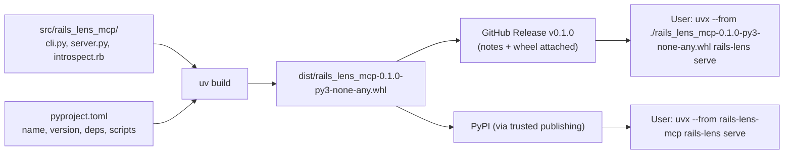

# 05 · Packaging and releasing a tool others can install

<!-- nav:top -->
[Course home](../../README.md) › [Step 8 plan](../../steps/08-ai-tool-mvp.md) › [Step 8 lessons](00-start-here.md) · [Glossary](../../GLOSSARY.md)
<!-- nav:end -->

## 1. In one sentence

Packaging turns your project folder into something a stranger can install and run with **one command** (`uvx --from rails-lens-mcp rails-lens serve`), and releasing means giving each version a number, notes and a public, installable artifact.

## 2. Why it exists

"Clone my repo, install uv, run `uv sync`, then `python src/...`" loses most users at step one. A published package gives them:

- **One-command install/run**, with dependencies resolved automatically.
- **A command name** (`rails-lens`) instead of a script path.
- **Versions** they can pin, and **release notes** that say what changed.

For your goal, "at least one real AI tool published on GitHub" means: public repo, a `v0.1.0` release, and install instructions that work on a clean machine. Publishing to PyPI is a strong extra.

## 3. Rails analogy

You have done all of this for gems:

| Ruby gem | Python package |
|---|---|
| `my_gem.gemspec` | `pyproject.toml` (`[project]` table) |
| `spec.executables` / `exe/my_gem` | `[project.scripts]` → `rails-lens = "rails_lens_mcp.cli:main"` |
| `spec.files` includes `lib/templates/*.erb` | Any file inside the package folder ships in the wheel (here `introspect.rb`) |
| `gem build` → `my_gem-0.1.0.gem` | `uv build` → `rails_lens_mcp-0.1.0-py3-none-any.whl` (+ a `.tar.gz` source archive) |
| RubyGems.org | PyPI (pypi.org); TestPyPI for trial uploads |
| `gem exec my_gem` / `npx` in JavaScript | `uvx` (runs a package's command in a temporary environment) |
| `version.rb` + `CHANGELOG.md` + Git tag `v0.1.0` | `__version__` / `version` in `pyproject.toml` + `CHANGELOG.md` + tag `v0.1.0` |
| Trusted publishing from GitHub Actions (RubyGems) | Trusted publishing from GitHub Actions (PyPI) |

Where it breaks: the **distribution name** (`rails-lens-mcp`, what you install), the **import name** (`rails_lens_mcp`, what Python imports) and the **command name** (`rails-lens`) can all differ. Gems usually keep them the same.

## 4. How it works



### Semantic versioning (SemVer)

`MAJOR.MINOR.PATCH`, for example `0.1.0`:

- **PATCH** (`0.1.1`): bug fixes, no behaviour change for users.
- **MINOR** (`0.2.0`): new tools or options, backwards compatible.
- **MAJOR** (`1.0.0`): breaking changes (a tool renamed or removed, a changed output shape).

While the version starts with `0.`, users expect things may still change. Your first public release is `v0.1.0`.

### What goes in the repository for a release

| File | Purpose |
|---|---|
| `LICENSE` | MIT is a common, simple choice; without a licence, others may not legally use your code. |
| `README.md` | Problem, quick start, how it works, eval results, security, limitations (template in the Step 8 plan). |
| `CHANGELOG.md` | One section per version: Added / Changed / Fixed (the "Keep a Changelog" format). |
| `EVALS.md` | How you measured, and the results (lesson 06). |
| `SECURITY.md` | What the tool can access, and how to report a vulnerability. |

## 5. Minimal working example

Create the project skeleton:

```bash
uv init --package --name rails-lens-mcp rails-lens-mcp
cd rails-lens-mcp
uv add "mcp>=2.2,<3"
cp ~/code/rails-lens-mcp-prototype/introspect.rb src/rails_lens_mcp/   # lesson 01
cp ~/code/rails-lens-mcp-prototype/rails_lens.py src/rails_lens_mcp/server.py   # lesson 03
```

Edit `pyproject.toml` (tested with uv 0.8 and its `uv_build` backend; keep the `[build-system]` lines that `uv init` generated for your uv version):

```toml
[project]
name = "rails-lens-mcp"
version = "0.1.0"
description = "An MCP server that gives AI assistants an accurate map of a Rails app"
readme = "README.md"
license = "MIT"
requires-python = ">=3.11"
dependencies = ["mcp>=2.2,<3"]

[project.scripts]
rails-lens = "rails_lens_mcp.cli:main"

[build-system]
requires = ["uv_build>=0.8.17,<0.9.0"]
build-backend = "uv_build"
```

`src/rails_lens_mcp/__init__.py`:

```python
"""rails-lens: give AI assistants an accurate map of a Rails app."""

__version__ = "0.1.0"
```

`src/rails_lens_mcp/cli.py`, the `rails-lens` command with two subcommands:

```python
import argparse
import json
import os
import subprocess
import sys
from importlib.resources import as_file, files
from pathlib import Path

from rails_lens_mcp import __version__

CACHE_DIR = Path(os.environ.get("RAILS_LENS_CACHE", Path.home() / ".cache" / "rails-lens"))


def git_sha(app: Path) -> str:
    return subprocess.run(["git", "rev-parse", "HEAD"], cwd=app, capture_output=True,
                          text=True, check=True).stdout.strip()


def build_index(app: Path) -> Path:
    """Run the bundled introspect.rb inside the app and cache the result by commit."""
    CACHE_DIR.mkdir(parents=True, exist_ok=True)
    output = CACHE_DIR / f"{app.name}-{git_sha(app)}.json"
    with as_file(files("rails_lens_mcp") / "introspect.rb") as script:  # a real path to the packaged file
        result = subprocess.run(["bin/rails", "runner", str(script), str(output)], cwd=app,
                                capture_output=True, text=True, timeout=180)
    if result.returncode != 0:
        sys.exit(f"Could not boot the app (live mode failed):\n{result.stderr[-2000:]}")
    return output


def main(argv: list[str] | None = None) -> None:
    parser = argparse.ArgumentParser(prog="rails-lens", description="An MCP server that maps a Rails app.")
    parser.add_argument("--version", action="version", version=f"rails-lens {__version__}")
    commands = parser.add_subparsers(dest="command", required=True)
    for name, help_text in [("index", "build the index for the app (run after pulling new code)"),
                            ("serve", "run the MCP server over stdio")]:
        command = commands.add_parser(name, help=help_text)
        command.add_argument("--app", type=Path, default=Path.cwd(), help="Rails app directory (default: .)")
    args = parser.parse_args(argv)
    app = args.app.resolve()

    if args.command == "index":
        path = build_index(app)
        summary = json.loads(path.read_text())
        print(f"Indexed {len(summary['models'])} models, {len(summary['routes'])} routes → {path}")
    elif args.command == "serve":
        os.environ["RAILS_LENS_APP"] = str(app)
        from rails_lens_mcp.server import mcp  # imported late so it reads RAILS_LENS_APP

        mcp.run()
```

Two details worth understanding:

- `files("rails_lens_mcp") / "introspect.rb"` finds the Ruby script **inside the installed package**, wherever it was installed. `as_file(...)` gives a real file path you can pass to `bin/rails runner`.
- The server is imported inside the `serve` branch, after `RAILS_LENS_APP` is set, because `server.py` reads that variable when it is imported.

Build, then try the package exactly as a user would, from the built wheel:

```bash
uv build
uvx --from dist/rails_lens_mcp-0.1.0-py3-none-any.whl rails-lens --help
cd ~/code/shop-lab
uvx --from ~/code/rails-lens-mcp/dist/rails_lens_mcp-0.1.0-py3-none-any.whl rails-lens index
```

Output (tested):

```
usage: rails-lens [-h] [--version] {index,serve} ...

An MCP server that maps a Rails app.

positional arguments:
  {index,serve}
    index        build the index for the app (run after pulling new code)
    serve        run the MCP server over stdio
...
Indexed 4 models, 7 routes → /home/you/.cache/rails-lens/shop-lab-7b0afcb3....json
```

Register it in Claude Code for the current Rails app:

```bash
claude mcp add rails-lens -- uvx --from rails-lens-mcp rails-lens serve --app "$PWD"
```

(`--from rails-lens-mcp` is needed because the package name and the command name differ.)

### Releasing v0.1.0 on GitHub

```bash
# 1. Update CHANGELOG.md, make sure CI is green on main.
git tag v0.1.0
git push origin v0.1.0
# 2. Create the release with the wheel attached (GitHub CLI):
gh release create v0.1.0 dist/* --title "v0.1.0" --notes-file RELEASE_NOTES.md
```

### Optional: publishing to PyPI with trusted publishing

Trusted publishing lets GitHub Actions upload to PyPI **without storing a password or token**. On pypi.org, add a "trusted publisher" for your repository and workflow file (try TestPyPI first), then:

```yaml
# .github/workflows/release.yml
name: Release
on:
  push:
    tags: ["v*"]
jobs:
  pypi:
    runs-on: ubuntu-latest
    environment: pypi
    permissions:
      id-token: write   # required for trusted publishing
    steps:
      - uses: actions/checkout@v7
      - uses: astral-sh/setup-uv@v7
      - run: uv build
      - uses: pypa/gh-action-pypi-publish@release/v1
```

After that, anyone can run `uvx --from rails-lens-mcp rails-lens serve`.

## 6. Key terms

- **Distribution / import / command name**: what you install / what you import / what you type.
- **Wheel (`.whl`)**: the built, installable package file.
- **Build backend**: the tool that builds the wheel (`uv_build` here).
- **Console script / entry point**: a command created from `[project.scripts]`.
- **Package data**: non-Python files inside the package (like `introspect.rb`).
- **`uvx`**: run a package's command without installing it permanently.
- **SemVer**: `MAJOR.MINOR.PATCH` versioning.
- **Trusted publishing**: publishing from CI using short-lived credentials instead of a stored token.

## 7. Common mistakes

- **Testing only from the source folder.** Always test the **built wheel** with `uvx --from dist/...whl`; that is how you find missing package files.
- **Loose dependency ranges** (`mcp`), so a future major version breaks your users. Pin a compatible range (`mcp>=2.2,<3`).
- **Hard-coded paths** to your laptop in code or docs.
- **No `LICENSE` file.**
- **Publishing secrets** (an `.env`, a test API key) inside the package. Check the wheel's file list before releasing.
- **Skipping TestPyPI** for the first upload.
- **Changing tool names or output shapes in a patch release.** That is a breaking change.

## 8. Check your understanding

1. What are the distribution name, the import name and the command name of this project?
2. Why does `cli.py` use `importlib.resources.files` instead of a path like `"src/rails_lens_mcp/introspect.rb"`?
3. Why must you test with `uvx --from dist/...whl` before releasing?
4. You rename the tool `find_routes` to `search_routes`. What should the next version number be after `0.3.2`, and why?
5. What problem does trusted publishing solve?

<details>
<summary>Answers</summary>

1. `rails-lens-mcp` (install), `rails_lens_mcp` (import), `rails-lens` (command).
2. After installation there is no `src/` folder; `files()` locates the file inside the installed package wherever it lives.
3. It proves the wheel contains everything (for example `introspect.rb`) and that the command works outside your development folder.
4. It is a breaking change. Before 1.0, bump the minor version (`0.4.0`) and note it clearly in the changelog; after 1.0 it would need a major version.
5. You do not have to create, store and rotate a long-lived PyPI token in GitHub secrets; each publish uses short-lived credentials tied to your workflow.

</details>

## 9. Go deeper (optional)

- uv docs: [Building and publishing a package](https://docs.astral.sh/uv/guides/package/) and [Tools (`uvx`)](https://docs.astral.sh/uv/guides/tools/).
- Python Packaging User Guide: [Writing your `pyproject.toml`](https://packaging.python.org/en/latest/guides/writing-pyproject-toml/) and [Publishing with GitHub Actions (trusted publishing)](https://packaging.python.org/en/latest/guides/publishing-package-distribution-releases-using-github-actions-ci-cd-workflows/).
- [Semantic Versioning](https://semver.org) and [Keep a Changelog](https://keepachangelog.com).

<!-- nav:bottom -->

---

[← 04 · Evaluating your tool: ground truth and A/B evals](04-evaluating-your-tool.md) · [Step 8 lessons](00-start-here.md) · [06 · Writing an eval report →](06-writing-an-eval-report.md)
<!-- nav:end -->
