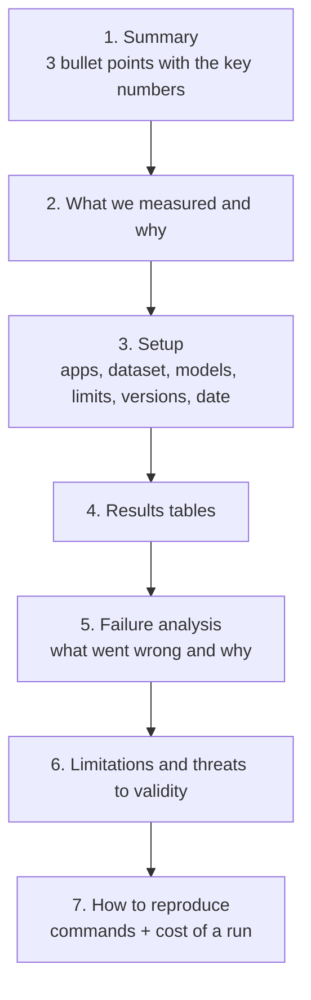

# 06 · Writing an eval report

<!-- nav:top -->
[Course home](../../README.md) › [Step 8 plan](../../steps/08-ai-tool-mvp.md) › [Step 8 lessons](00-start-here.md) · [Glossary](../../GLOSSARY.md)
<!-- nav:end -->

## 1. In one sentence

An **eval report** (`EVALS.md`) explains, for a reader who was not there, **what you measured, how, what you found and what you did not measure**, so that anyone can judge (and reproduce) the claim that your tool works.

## 2. Why it exists

Your results are only as convincing as the reader's ability to trust them. A bare "94% accuracy" raises questions immediately: 94% of what? Compared with what? On which app? How many runs? What did it cost? A good report answers those questions before they are asked. It is also the core of your Blog post #2 and the strongest proof of completion for Step 8.

## 3. Rails analogy

It is the performance write-up you did in Step 1 (`perf/results.md`), with the same rules:

| Step 1 perf report | EVALS.md |
|---|---|
| Machine, Ruby/Rails versions, data size | Model IDs, tool version, apps, dataset size |
| Exact commands to reproduce | Exact commands to reproduce |
| Baseline vs change, one change at a time | Without vs with the tool, same model and limits |
| p50/p95, not just averages | Accuracy plus tokens, turns, cost, time; runs and variation |
| "What did not help" | Failure analysis and limitations |

## 4. How it works

### The structure



### What each section must contain

| Section | Must contain | Example |
|---|---|---|
| **Summary** | The headline numbers and the comparison | "On Mastodon, rails-lens raised fact accuracy from 71% to 94% and cut tokens per question by 73%." |
| **What we measured** | The claims and the metric for each | Accuracy (exact match), tokens, turns, cost, time |
| **Setup** | Apps and their size, number of questions and how they were made, model IDs, turn limit, number of runs, versions, date | "2 apps (4 and 120 models), 312 generated questions, `claude-opus-5-5`, max 10 turns, 3 runs each, rails-lens 0.1.0, 12 Dec 2026" |
| **Results** | Tables per app and per arm; averages **and** spread across runs | See Part A below |
| **Failure analysis** | Categories of failures with counts and one example each | "11 failures: 6 polymorphic associations, 3 STI subclasses, 2 answer-format errors" |
| **Limitations** | What the numbers do *not* show | "Questions are generated from the index itself, so they favour the facts rails-lens knows; layer-3 tasks are only 15." |
| **Reproduce** | Commands, and what a full run costs | "`uv run python ab_eval.py path/to/app` (≈ $9 per full run)" |

### Writing the numbers honestly

- **Report the baseline next to every result.**
- **Say how many runs**, and show variation (for example "94% ± 2% over 3 runs").
- **Do not round in your favour**, and do not drop failed runs.
- **Separate development and final numbers.** If you tuned tool descriptions on the Mastodon questions, say so, and report on a second app you did not tune on.
- **Name the limitations yourself.** Readers trust a report more when it points out its own weak spots.

## 5. Minimal working example

### Part A: generate the tables from your results

`report.py` reads the output of lesson 04's `ab_eval.py` and prints Markdown you can paste into `EVALS.md`:

```python
"""Turn evals/results/ab.json into the Markdown tables for EVALS.md."""
import json
from pathlib import Path
from statistics import mean

data = json.loads(Path("evals/results/ab.json").read_text())


def row(label: str, runs: list[dict]) -> str:
    return (f"| {label} | {mean(r['correct'] for r in runs):.0%} | {mean(r['tokens'] for r in runs):,.0f} "
            f"| {mean(r['turns'] for r in runs):.1f} | ${mean(r['cost'] for r in runs):.4f} "
            f"| {mean(r['seconds'] for r in runs):.1f} s |")


lines = [
    f"Questions: {len(data['with'])} (generated from the live index)",
    "",
    "| Arm | Accuracy | Tokens / question | Turns / question | Cost / question | Time / question |",
    "|---|---|---|---|---|---|",
    row("With rails-lens", data["with"]),
    row("Without (grep + read)", data["without"]),
    "",
    "Failures with rails-lens (first 10):",
    "",
]
failures = [r for r in data["with"] if not r["correct"]][:10]
lines += [f"- `{r['id']}`: expected {r['expected']}, got {r['answer']}" for r in failures] or ["- none"]
print("\n".join(lines))
```

```bash
uv run python report.py > evals/results/table.md
```

Output shape (run against a stub, so the numbers themselves are meaningless):

```
Questions: 18 (generated from the live index)

| Arm | Accuracy | Tokens / question | Turns / question | Cost / question | Time / question |
|---|---|---|---|---|---|
| With rails-lens | 6% | 300 | 2.0 | $0.0028 | 0.0 s |
| Without (grep + read) | 6% | 300 | 2.0 | $0.0028 | 0.0 s |

Failures with rails-lens (first 10):

- `Customer-has_many`: expected ['Order'], got ['Customer']
...
```

Generating tables with a script, rather than typing numbers, means the report always matches the data.

### Part B: an `EVALS.md` skeleton

Copy this into your repository and fill it in. The numbers below are **placeholders** to show the format.

```markdown
# Evaluation of rails-lens v0.1.0

## Summary
- On two Rails apps, rails-lens raised fact accuracy from **XX%** (grep + read) to **YY%**.
- Tokens per question fell from **N** to **M** (−Z%); time per question from **A s** to **B s**.
- All **12** safety cases passed (secret files refused, paths outside the app refused).

## What we measured
1. Fact accuracy: exact-match answers to questions generated from Rails' own reflection (ground truth).
2. Efficiency: tokens, turns, cost and seconds per question.
3. Real tasks: 15 hand-written developer tasks, graded by deterministic checks and a judge
   (claude-sonnet-5, 85% agreement with my labels on 20 answers).
4. Safety: 12 adversarial cases.

## Setup
| | |
|---|---|
| Apps | shop-lab (4 models, 7 routes); Mastodon at commit abc123 (N models, M routes) |
| Questions | 312 generated (layer 2); 15 hand-written tasks (layer 3) |
| Model | claude-opus-5-5, max 10 turns, max_tokens 8000 |
| Baseline tools | search_code (ripgrep, fixed strings), read_file |
| Runs | 3 per arm; mean ± spread shown |
| Versions / date | rails-lens 0.1.0, mcp 2.2, 12 Dec 2026 |

## Results
(paste the tables from report.py, one per app)

## Failure analysis
| Category | Count | Example | Planned fix |
|---|---|---|---|
| Polymorphic associations | 6 | `Comment belongs_to :commentable` answered as one class | Include `polymorphic: true` in the index |

## Limitations
- Layer-2 questions come from the same index the tool uses; they measure delivery of facts, not discovery.
- 15 real tasks is a small sample.
- Tool descriptions were tuned on shop-lab; Mastodon results are the fairer estimate.

## Reproduce
    uv run python generate_questions.py path/to/index.json
    uv run python ab_eval.py path/to/app          # about $X for a full run
    uv run python report.py
```

## 6. Key terms

- **Eval report**: the document that presents evaluation method and results.
- **Headline metric**: the one number that best supports the main claim.
- **Threats to validity / limitations**: reasons the results might not hold in general.
- **Reproducibility**: someone else can rerun your evaluation and get similar numbers.
- **Development vs held-out results**: numbers on data you tuned on vs data you did not.

## 7. Common mistakes

- **Headline without a baseline.**
- **Hand-typed numbers** that drift from the data.
- **Hiding failures** or only showing cherry-picked examples.
- **No setup details** (which model, how many questions, how many runs).
- **Overclaiming** ("rails-lens makes AI understand Rails") instead of what you measured.
- **Forgetting cost**: say what a full eval run costs, so others can reproduce it.

## 8. Check your understanding

1. Why should the summary include the baseline number, not just the tool's number?
2. You tuned tool descriptions using the Mastodon questions. How should that affect how you present Mastodon results?
3. What belongs in "Limitations" for rails-lens's layer-2 questions?
4. Why generate the result tables with a script?
5. Which three setup details would a sceptical reader ask for first?

<details>
<summary>Answers</summary>

1. The improvement is the claim; a number without a comparison cannot show that the tool helped.
2. Say so explicitly, and give more weight to results on an app you did not tune on (a held-out app).
3. That the questions are generated from the same index the tool serves, so they test fact delivery rather than discovery, and that they favour the kinds of facts rails-lens already captures.
4. So the report always matches the raw data, and updating it after a new run is one command.
5. Any three of: which model and limits, how many questions and how they were made, which apps (and their size), how many runs, which baseline tools.

</details>

## 9. Go deeper (optional)

- Hamel Husain, ["Your AI Product Needs Evals"](https://hamel.dev/blog/posts/evals/) (sections on looking at data and reporting).
- The Step 1 perf report you wrote: reuse its structure.
- [templates/blog-post-outline.md](../../templates/blog-post-outline.md): turn this report into Blog post #2.

<!-- nav:bottom -->

---

[← 05 · Packaging and releasing a tool others can install](05-packaging-and-releasing.md) · [Step 8 lessons](00-start-here.md) · [07 · Building blocks for Options B and C (GitHub bots) →](07-github-bots-for-options-b-and-c.md)
<!-- nav:end -->
