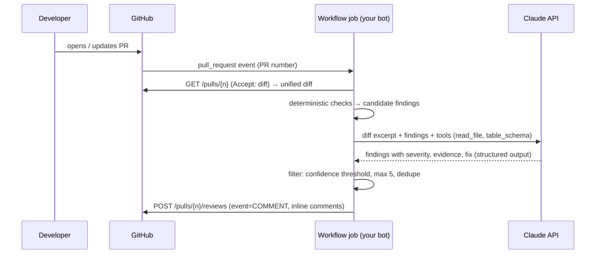
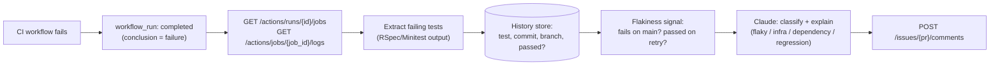

# 07 · Building blocks for Options B and C (GitHub bots)

<!-- nav:top -->
[Course home](../../README.md) › [Step 8 plan](../../steps/08-ai-tool-mvp.md) › [Step 8 lessons](00-start-here.md) · [Glossary](../../GLOSSARY.md)
<!-- nav:end -->

Read this lesson only if you chose **Option B** (`rails-pr-reviewer`) or **Option C** (`ci-triage-agent`). Both are **bots that run in GitHub Actions**, read something from GitHub (a PR diff or CI logs), think, and write back (review comments or a PR comment).

## 1. In one sentence

A GitHub bot is a program that a **workflow trigger** starts (a PR is opened, a CI run fails), that reads data through the **GitHub REST API** with a scoped token, combines **deterministic checks** with a model, and posts **a small number of high-precision comments** back.

## 2. Why it exists

Both options live where developers already work (the pull request), so there is nothing to install on laptops. But bots have a harsh reputation problem: **one noisy week and people ignore or disable them**. So the engineering focus is different from rails-lens:

- **Precision over recall:** better 2 correct comments than 10 comments with 4 wrong.
- **Deterministic first:** anything a rule can check reliably (unsafe `add_index`, a test that failed on `main` yesterday) is checked in code; the model explains, prioritises and handles what rules cannot.
- **Least privilege:** the workflow token gets only the permissions it needs.

## 3. Rails analogy

| GitHub bot | Rails |
|---|---|
| Workflow trigger (`pull_request`, `workflow_run`) | A webhook controller or an `after_commit` that enqueues a job |
| The workflow job | A background job |
| `GITHUB_TOKEN` with `permissions:` | A scoped API key with Pundit-style permissions |
| Deterministic checks (`migration_check.py`) | RuboCop / `strong_migrations` rules |
| The model's explanation | A senior reviewer's comment on top of the linter output |
| A cap of 5 comments per PR | Rate limiting a notification mailer |

## 4. How it works

### Option B: PR reviewer



```yaml
# .github/workflows/pr-review.yml
name: PR review bot
on:
  pull_request:
    types: [opened, synchronize]
permissions:
  contents: read
  pull-requests: write
jobs:
  review:
    runs-on: ubuntu-latest
    steps:
      - uses: actions/checkout@v7
      - uses: astral-sh/setup-uv@v7
      - run: uv run python -m pr_reviewer --pr ${{ github.event.pull_request.number }}
        env:
          GITHUB_TOKEN: ${{ secrets.GITHUB_TOKEN }}
          ANTHROPIC_API_KEY: ${{ secrets.ANTHROPIC_API_KEY }}
```

Security note: for pull requests **from forks**, repository secrets are not passed to `pull_request` workflows. Do not "fix" that with `pull_request_target` plus checking out the fork's code: that runs untrusted code with your secrets. For a first version, run the bot on your own repositories only.

### Option C: CI triage



```yaml
# .github/workflows/ci-triage.yml
name: CI triage
on:
  workflow_run:
    workflows: ["CI"]
    types: [completed]
permissions:
  actions: read
  contents: read
  pull-requests: write
jobs:
  triage:
    if: ${{ github.event.workflow_run.conclusion == 'failure' }}
    runs-on: ubuntu-latest
    steps:
      - uses: actions/checkout@v7
      - uses: astral-sh/setup-uv@v7
      - run: uv run python -m ci_triage --run-id ${{ github.event.workflow_run.id }}
        env:
          GITHUB_TOKEN: ${{ secrets.GITHUB_TOKEN }}
          ANTHROPIC_API_KEY: ${{ secrets.ANTHROPIC_API_KEY }}
```

### The GitHub REST API calls you need

All calls send `Authorization: Bearer $GITHUB_TOKEN`, `Accept: application/vnd.github+json` (unless noted) and `X-GitHub-Api-Version: 2022-11-28`.

| Purpose | Call |
|---|---|
| PR diff (B) | `GET /repos/{owner}/{repo}/pulls/{number}` with `Accept: application/vnd.github.diff` |
| Post a review with inline comments (B) | `POST /repos/{owner}/{repo}/pulls/{number}/reviews` with `{"event": "COMMENT", "body": "...", "comments": [{"path": "...", "line": 4, "side": "RIGHT", "body": "..."}]}` |
| Jobs of a run (C) | `GET /repos/{owner}/{repo}/actions/runs/{run_id}/jobs` |
| Logs of a job (C) | `GET /repos/{owner}/{repo}/actions/jobs/{job_id}/logs` (answers with a redirect; follow it) |
| Comment on a PR (C) | `POST /repos/{owner}/{repo}/issues/{number}/comments` with `{"body": "..."}` |

```python
import os

import httpx

GITHUB = httpx.Client(
    base_url="https://api.github.com",
    headers={"Authorization": f"Bearer {os.environ['GITHUB_TOKEN']}",
             "X-GitHub-Api-Version": "2022-11-28"},
    follow_redirects=True,  # job logs redirect to a download URL
    timeout=30,
)


def pr_diff(repo: str, number: int) -> str:
    response = GITHUB.get(f"/repos/{repo}/pulls/{number}", headers={"Accept": "application/vnd.github.diff"})
    response.raise_for_status()
    return response.text


def post_review(repo: str, number: int, comments: list[dict]) -> None:
    payload = {"event": "COMMENT", "body": f"rails-pr-reviewer found {len(comments)} issue(s).",
               "comments": comments}
    GITHUB.post(f"/repos/{repo}/pulls/{number}/reviews", json=payload).raise_for_status()
```

(These need a real token and repository, so run them in a test repository you own.)

## 5. Minimal working example

The deterministic half of Option B, runnable offline. It reads a unified diff, tracks **new-file line numbers** (which inline review comments need), and flags `add_index` without `algorithm: :concurrently` in migrations.

`sample.diff`:

```diff
diff --git a/db/migrate/20261201090000_add_status_to_orders.rb b/db/migrate/20261201090000_add_status_to_orders.rb
new file mode 100644
index 0000000..1111111
--- /dev/null
+++ b/db/migrate/20261201090000_add_status_to_orders.rb
@@ -0,0 +1,6 @@
+class AddStatusToOrders < ActiveRecord::Migration[8.1]
+  def change
+    add_column :orders, :refund_reason, :string
+    add_index :orders, :status
+  end
+end
diff --git a/app/models/order.rb b/app/models/order.rb
index 2222222..3333333 100644
--- a/app/models/order.rb
+++ b/app/models/order.rb
@@ -1,3 +1,4 @@
 class Order < ApplicationRecord
+  add_index_note = "not a migration"
   belongs_to :customer
 end
```

`migration_check.py`:

```python
"""Deterministic checks on a unified diff: the cheap, reliable half of a PR review bot."""
import re
import sys
from dataclasses import dataclass
from pathlib import Path

HUNK = re.compile(r"^@@ -\d+(?:,\d+)? \+(?P<start>\d+)(?:,\d+)? @@")
ADD_INDEX = re.compile(r"^\s*add_index\b")


@dataclass
class Finding:
    path: str
    line: int      # line number in the NEW file (what GitHub calls side=RIGHT)
    rule: str
    message: str


def added_lines(diff: str):
    """Yield (path, new_line_number, text) for every added line in a unified diff."""
    path, line_no = None, 0
    for raw in diff.splitlines():
        if raw.startswith("+++ "):
            path = raw[6:] if raw.startswith("+++ b/") else None
        elif m := HUNK.match(raw):
            line_no = int(m["start"])
        elif path and raw.startswith("+"):
            yield path, line_no, raw[1:]
            line_no += 1
        elif path and not raw.startswith("-"):
            line_no += 1  # context line: exists in the new file too


def check(diff: str) -> list[Finding]:
    findings = []
    migrations: dict[str, list[tuple[int, str]]] = {}
    for path, line, text in added_lines(diff):
        if path.startswith("db/migrate/"):
            migrations.setdefault(path, []).append((line, text))
    for path, lines in migrations.items():
        body = "\n".join(text for _, text in lines)
        for line, text in lines:
            if ADD_INDEX.match(text) and "algorithm: :concurrently" not in text:
                findings.append(Finding(path, line, "index-not-concurrent",
                                        "add_index without algorithm: :concurrently blocks writes on large tables."))
            if ADD_INDEX.match(text) and "algorithm: :concurrently" in text and "disable_ddl_transaction!" not in body:
                findings.append(Finding(path, line, "concurrent-in-transaction",
                                        "Concurrent index needs disable_ddl_transaction! in the migration."))
    return findings


if __name__ == "__main__":
    for f in check(Path(sys.argv[1]).read_text()):
        print(f"{f.path}:{f.line} [{f.rule}] {f.message}")
```

```bash
uv run python migration_check.py sample.diff
```

Output (tested):

```
db/migrate/20261201090000_add_status_to_orders.rb:4 [index-not-concurrent] add_index without algorithm: :concurrently blocks writes on large tables.
```

Line 4 is the `add_index` line in the **new** file, which is exactly the `line` (with `side: "RIGHT"`) that `post_review` needs. The added line in `app/models/order.rb` is ignored because it is not a migration. In the full bot, each `Finding` becomes a candidate that the model explains (with `table_schema` to see whether `orders` is large or has an index already), and only high-confidence findings are posted.

For **Option C**, the equivalent deterministic core is a flakiness signal from history. A test is likely flaky when it **passed on retry** in this run, or has **both passes and failures on `main`** in the last 7 days at the same commit or without related code changes.

## 6. Key terms

- **Workflow trigger**: the event that starts a workflow (`pull_request`, `workflow_run`, `workflow_dispatch`).
- **`GITHUB_TOKEN` / `permissions:`**: the automatic token for a workflow and the scopes you grant it.
- **Unified diff / hunk header**: the diff format; `@@ -a,b +c,d @@` gives the old and new starting lines.
- **Inline review comment**: a comment on a specific line (`path`, `line`, `side`).
- **False positive (bot)**: a comment about a problem that is not real.
- **Flaky test**: a test that passes and fails without relevant code changes.
- **`pull_request_target`**: a trigger that runs with secrets in the base repository's context; dangerous with untrusted code.

## 7. Common mistakes

- **Letting the model do what a rule can do.** Rules are cheaper, faster and never hallucinate.
- **Posting every finding.** Cap the number, deduplicate, and require evidence.
- **Using diff line positions instead of new-file line numbers** for inline comments.
- **Over-broad token permissions** (`write-all`).
- **`pull_request_target` + checkout of fork code.**
- **No labelled dataset**: without it you cannot measure false positives, which is the metric that decides whether people keep the bot.
- **For C: classifying from one run only.** Flakiness is a property over time; you need history.

## 8. Check your understanding

1. Why is precision (few false positives) more important than recall for a review bot?
2. What does `side: "RIGHT"` with `line: 4` mean in a review comment?
3. Why must the bot compute new-file line numbers from hunk headers rather than count lines in the diff?
4. Why is `pull_request_target` with a checkout of the PR's code dangerous?
5. For Option C, what two signals suggest a failure is flaky rather than a real regression?

<details>
<summary>Answers</summary>

1. Developers stop reading (or disable) a bot that is often wrong; a few trustworthy comments keep attention and deliver value.
2. Comment on line 4 of the file as it is after the change (the new version).
3. The diff contains headers, removed lines and several hunks; only the hunk header's `+start` plus counting context and added lines gives the real line number in the new file.
4. It runs with the base repository's secrets and write token while executing code from an untrusted fork, which could steal secrets or push changes.
5. It passed on retry in the same run, and it has both passes and failures on `main` recently without related code changes.

</details>

## 9. Go deeper (optional)

- GitHub docs: [Events that trigger workflows](https://docs.github.com/en/actions/reference/workflows-and-actions/events-that-trigger-workflows) and [Automatic token authentication](https://docs.github.com/en/actions/tutorials/authenticate-with-github_token).
- GitHub REST API: [Pull request reviews](https://docs.github.com/en/rest/pulls/reviews) and [Workflow jobs](https://docs.github.com/en/rest/actions/workflow-jobs).
- [strong_migrations](https://github.com/ankane/strong_migrations): a catalogue of unsafe migration patterns to turn into rules.

<!-- nav:bottom -->

---

[← 06 · Writing an eval report](06-writing-an-eval-report.md) · [Step 8 lessons](00-start-here.md) · [Back to the Step 8 plan →](../../steps/08-ai-tool-mvp.md)
<!-- nav:end -->
