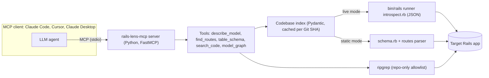
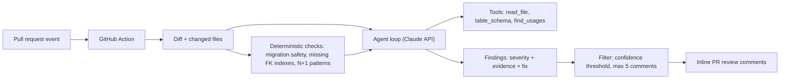
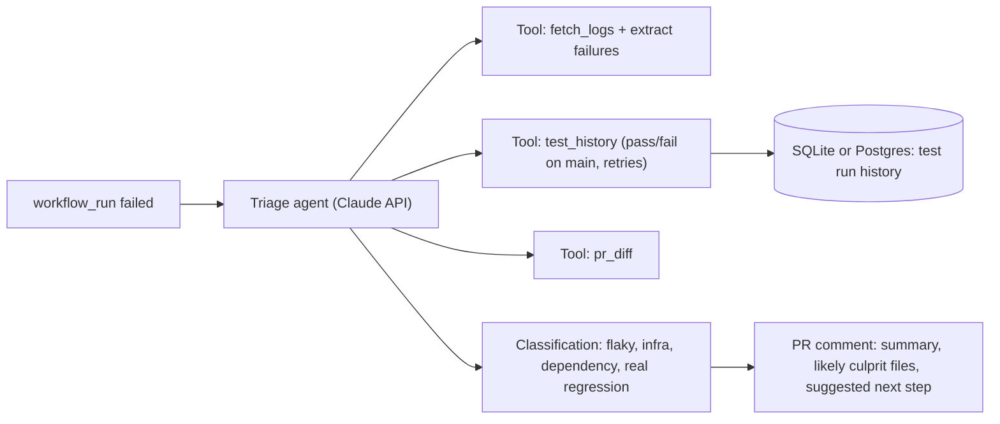

# Step 8: AI Tool MVP with Evals, Published on GitHub

| Weight | Dates | Hours |
|---|---|---|
| 15% | Mon 30 Nov - Tue 15 Dec 2026 (2 weeks + 2 days) | ~23 h |

**Key dates:** choose the option by Sun 29 Nov (end of Step 7) · feature freeze **Fri 11 Dec** · release **Mon 14 Dec** · Blog post #2 + final report **Tue 15 Dec**.

## 1. Objective

By 15 Dec you will have:

- Designed and shipped a small but real AI tool that solves a specific developer problem, with a clear scope and non-goals.
- Built it on the engineering from Step 7: well-designed tools, a bounded agent loop or MCP server, safety controls and cost tracking.
- Proved its quality with an **eval suite** (deterministic checks + calibrated model grading), with a regression check in CI and a public results report.
- Published it on GitHub as `v0.1.0` with a README that lets a stranger install and use it in under 5 minutes.
- Had at least 2 real users (teammates) try it, and fixed what they found.

## 2. Why it matters

- This is the main proof for the goal's success criterion "at least one real AI tool published on GitHub".
- It combines everything: Rails knowledge (Steps 1-3), open-source habits (Step 4), Python (Steps 5-6) and AI engineering (Step 7).
- A tool with honest evals stands out. Most public AI projects are demos without measurements.
- If your team adopts it, it becomes a lasting internal contribution, not just a learning exercise.

## 3. Day-by-day plan

The plan below is for the **recommended Option A**. For Option B or C, keep the same shape (core → evals → hardening → release) and use that option's milestone table in section 5.

### Week 1 (30 Nov - 6 Dec): core + evals

| Day | Topic | Concrete tasks | Hours |
|---|---|---|---|
| **Mon 30 Nov** | Scope + introspection | 1. Create the public repo; write `docs/adr/0001-scope.md` with goals and **non-goals** (read-only, no code edits). 2. Write `introspect.rb`: run with `bin/rails runner`, output JSON for models (table, columns, associations, validations, callbacks, scopes), routes and jobs. 3. Run it on `shop-lab`; save the JSON as a test fixture. | 1.5 |
| **Tue 1 Dec** | Index + static mode | 1. Pydantic models for the codebase index. 2. A static `db/schema.rb` parser as a fallback when the app cannot boot. 3. Cache the index per Git SHA. | 1.5 |
| **Wed 2 Dec** | MCP tools 1-3 | `describe_model(name)`, `find_routes(path_or_controller)`, `table_schema(table)`. Compact outputs with file paths. Test each in the MCP Inspector. | 1.25 |
| **Thu 3 Dec** | MCP tools 4-5 | `search_code(pattern, glob)` (a ripgrep wrapper restricted to the repo) and `model_graph(name, depth)` (Mermaid of associations). Unit tests for all tools. | 1.25 |
| **Fri 4 Dec** | Eval harness 1 | Auto-generate **≥ 100 ground-truth questions** from the introspection JSON of 2 apps (e.g. "Which models does `Order` belong to?"); score tool answers exactly. Send the weekly update. | 1 |
| **Sat 5 Dec** | Eval harness 2 | Write **20 real developer tasks** (e.g. "Add a `status` filter to the orders index: which files and tables are involved?"). Run the Step 7 agent loop **with** and **without** the MCP tools; record success, tokens, turns and latency. | 2.5 |
| **Sun 6 Dec** | Review | Read 10 failed traces; list the top 3 causes; plan fixes. | 1 |
| | | **Week 1 total** | **10** |

### Week 2 (7 - 13 Dec): harden, package, pilot

| Day | Topic | Concrete tasks | Hours |
|---|---|---|---|
| **Mon 7 Dec** | Fix + re-run | Fix the top 3 failure causes (tool descriptions, output shape, missing data); re-run both evals and record the change. | 1.5 |
| **Tue 8 Dec** | Safety | Path allowlist and traversal tests; never return `config/credentials*`, `.env` or `master.key`; live mode off by default, runs only the bundled script; timeouts on every tool. Add these as eval cases. | 1.5 |
| **Wed 9 Dec** | Packaging | Installable with `uvx`; config snippets for Claude Code, Claude Desktop and Cursor; `--app-path` and `--mode static\|live` flags. | 1.25 |
| **Thu 10 Dec** | CI | Lint, types, unit tests + the **deterministic eval on every PR** (fixture app); the agent eval as a manual `workflow_dispatch` job (controls API cost). | 1.25 |
| **Fri 11 Dec** | **Feature freeze** + docs | README from the template below; `EVALS.md` with results; a short demo GIF or asciinema. Send the weekly update. | 1 |
| **Sat 12 Dec** | Pilot | 2 teammates use it on the work app (or a real open-source app) for 30 minutes; collect feedback; fix the most important issue. | 2.5 |
| **Sun 13 Dec** | Buffer | Finish any open item; draft Blog post #2. | 1 |
| | | **Week 2 total** | **10** |

### Launch (14 - 15 Dec)

| Day | Concrete tasks | Hours |
|---|---|---|
| **Mon 14 Dec** | Tag and release `v0.1.0` with release notes; (optional) publish to PyPI; final eval run recorded in `EVALS.md`. | 1.5 |
| **Tue 15 Dec** | Publish Blog post #2; send the final report to your manager (all 8 steps, links, numbers); update the README tracker to 100%. | 1.5 |

## 4. Topic checklist

- [ ] Problem framing: can state the problem, target users, success metric and non-goals in one page.
- [ ] Tool/agent design: applies Step 7 practices (few, clear tools; compact outputs; limits; traces).
- [ ] Ground truth: can build a dataset where correct answers are checkable automatically where possible.
- [ ] Eval design: combines deterministic metrics, calibrated model grading and a baseline comparison (with vs without the tool).
- [ ] Regression: evals run in CI with thresholds; results are versioned.
- [ ] Safety: least privilege, input validation, secret redaction, prompt-injection cases.
- [ ] Cost and latency: reports cost per task and p95 latency; knows the main cost levers.
- [ ] Packaging: one-command install, clear config, semantic versioning, CHANGELOG, licence.
- [ ] Communication: README, eval report, release notes and a blog post that a stranger can follow.

## 5. Hands-on lab: choose and build the MVP

### Option A (recommended): `rails-lens-mcp`, an MCP server that gives AI assistants accurate knowledge of a Rails codebase

**Problem:** AI coding assistants often guess about Rails apps: they miss associations defined in concerns, invent columns, and do not know routes or callbacks. They waste tokens grepping and still get it wrong.
**Target users:** Rails developers using Claude Code, Cursor or other MCP clients; Rails teams onboarding new engineers.
**Prior art:** check existing projects such as the `rails-mcp-server` gem (verify) and explain in the README what is different (live introspection + published evals).



| Item | Details |
|---|---|
| **Tech stack** | Python 3.13, `mcp` SDK (FastMCP), Pydantic v2, a Ruby introspection script, ripgrep, pytest, GitHub Actions |
| **Eval plan** | (1) **Tool correctness:** ≥ 100 auto-generated questions per app from introspection JSON, exact-match scoring; target ≥ 95%. (2) **Agent A/B:** 20 real tasks with vs without the server; metrics: task success (rubric + calibrated judge), tokens, turns, p95 latency; target +20 points success or −30% tokens. (3) **Safety:** secret files never returned, path traversal blocked, live mode off by default: 100% pass required. |
| **Milestones** | M1 (2 Dec): index + 3 tools · M2 (5 Dec): 5 tools + both eval harnesses · M3 (8 Dec): fixes + safety · M4 (11 Dec): packaged, CI, docs (freeze) · M5 (14 Dec): pilot feedback fixed, `v0.1.0` |

**Why recommended:** it reuses Steps 1-3 (Rails internals) and Step 7 (MCP) directly; ground truth comes from Rails itself, so evals are objective and cheap; it is read-only, so the safety surface is small; and it is useful to your team on day one.

### Option B: `rails-pr-reviewer`, an AI reviewer for risky Rails changes

**Problem:** Reviewers miss unsafe migrations, missing indexes and N+1-prone code, and general AI reviewers produce noisy comments.
**Target users:** Rails teams using GitHub pull requests.



| Item | Details |
|---|---|
| **Tech stack** | Python, Anthropic SDK, GitHub REST API (`httpx`), GitHub Actions, pytest |
| **Eval plan** | 40 labelled diffs (20 from public Rails repos' history, 20 synthetic with seeded issues + 10 clean diffs). Metrics: precision and recall per issue class, **false positives per PR ≤ 0.5**, cost per PR, p95 run time. |
| **Milestones** | M1: diff ingestion + deterministic checks · M2: agent + tools + findings schema · M3: labelled dataset + eval runner · M4: noise filter tuned on eval, safety (no secrets in prompts) · M5: Action published + README |

### Option C: `ci-triage-agent`, a failed-build triage assistant

**Problem:** Engineers lose time reading long CI logs and re-running flaky tests; real regressions get ignored as "probably flaky".
**Target users:** Any team on GitHub Actions (Rails test suites especially).



| Item | Details |
|---|---|
| **Tech stack** | Python, Anthropic SDK, GitHub REST API, SQLite/Postgres, pytest, GitHub Actions |
| **Eval plan** | 50 historical failures labelled by hand. Metrics: classification accuracy and macro-F1, top-3 culprit-file hit rate, cost and latency per run; baseline = log-regex heuristics. |
| **Milestones** | M1: log fetch + failure extraction · M2: history store + flakiness signal · M3: agent + classification · M4: labelled dataset + evals · M5: Action/bot published + README |

### Acceptance criteria (any option)

- [ ] Public GitHub repo with licence, `v0.1.0` release and a README following the template below.
- [ ] Installs and runs from the README in under 5 minutes on a clean machine (ask a teammate to test).
- [ ] `EVALS.md` reports every metric in the eval plan, the baseline comparison, dataset size and cost of the eval run.
- [ ] A deterministic eval runs in CI on every PR with a threshold; the model-graded eval can be run on demand.
- [ ] Safety cases are part of the eval suite and pass.
- [ ] At least 2 people other than you have used it; their feedback and your changes are in the CHANGELOG or an issue.

## 6. Deliverable / proof of completion

1. **Public repo link** + **`v0.1.0` release link**.
2. **`EVALS.md`** with results (link in the final report).
3. **Blog post #2** link.
4. **Final report** to your manager: one table with all 8 steps, proof links and key numbers.

### README template for the public repository

```markdown
# <project-name>

<One sentence: what it does and for whom.>


## Why
<The problem in 3-4 sentences. What goes wrong today without this tool.>

## Features
- <Feature 1>
- <Feature 2>
- Read-only by design: <safety statement>

## Quick start
    uvx <project-name> --app-path /path/to/rails/app
<Client config snippets: Claude Code, Claude Desktop, Cursor.>

## How it works
<Mermaid architecture diagram + 3-5 bullet explanation.>

## Evaluation
| Metric | Result | Target |
|---|---|---|
| <tool correctness> | <x%> | ≥ 95% |
| <task success with vs without> | <x% vs y%> | +20 pts |
| <tokens per task> | <n vs m> | −30% |
| <safety cases> | <n/n> | 100% |
Dataset, method and how to reproduce: see [EVALS.md](EVALS.md).

## Configuration
<Flags and environment variables, with defaults.>

## Security
<What it can and cannot access. How to report a vulnerability.>

## Limitations and roadmap
<Honest known limits. Next 3 planned items.>

## Development
<Setup, tests, running evals, contributing.>

## License
MIT
```

## 7. Curated resources

1. **Model Context Protocol docs and spec** (server concepts, transports, security best practices): https://modelcontextprotocol.io
2. **MCP Python SDK** (FastMCP servers, Inspector, packaging): https://github.com/modelcontextprotocol/python-sdk
3. **Claude docs: Tool use** and **Prompt caching**: https://platform.claude.com/docs/en/agents-and-tools/tool-use/overview and https://platform.claude.com/docs/en/build-with-claude/prompt-caching
4. **Rails API: `ActiveRecord::Reflection`** (`reflect_on_all_associations`) and **`ActiveModel::Validations`** (`validators`), for `introspect.rb`: https://api.rubyonrails.org
5. **GitHub docs: Creating releases** and **Publishing actions in GitHub Marketplace** (Option B/C): https://docs.github.com/en/repositories/releasing-projects-on-github and https://docs.github.com/en/actions/sharing-automations/creating-actions/publishing-actions-in-github-marketplace (verify path)
6. **uv: Building and publishing a package** (for `uvx` installs and PyPI): https://docs.astral.sh/uv/guides/package/
7. **Hamel Husain, "Your AI Product Needs Evals"**: https://hamel.dev/blog/posts/evals/

## 8. Self-check questions

1. What is the one metric that shows your tool is worth using, and what was its baseline without the tool?
2. Which parts of your ground truth are generated automatically, and how do you know the generator itself is correct?
3. Where could your eval results be misleading (dataset bias, judge bias, overfitting to the eval set)?
4. What happens when the target Rails app cannot boot (missing credentials, services)? How does the tool degrade?
5. What is the worst thing a malicious repository or PR could make your tool do, and what stops it?
6. How much does one typical use cost, and what would you change first if usage grew 100×?
7. Which feature did you cut to meet the freeze, and why was that the right cut?
8. What did the pilot users do that you did not expect?
9. How would a new contributor add a new tool and its eval cases?
10. If you had 2 more weeks, what would you build next, and what evidence supports that choice?

## 9. Common pitfalls

- **Scope creep**: adding tools instead of making 5 tools excellent. Respect the freeze.
- **Evals written last**, or only on happy paths. Start the harness in week 1.
- **Only model-graded evals** when deterministic checks are possible (and cheaper and more reliable).
- **No baseline**: without "with vs without the tool", improvements cannot be shown.
- **Leaking secrets**: returning `.env`, credentials or tokens in tool output or traces.
- **Running evals in CI on every push with a paid model**, which gets expensive quickly; gate the costly suite.
- **A README that assumes context**: test the install with someone who has never seen the project.
- **Overclaiming** in the README or blog post; report limits honestly.

## 10. Stretch goals

- Publish to PyPI and add the server to a public MCP server registry (verify the current registry process).
- Add a Ruby-native version of the introspection as a gem, so Rails users can `bundle add` it.
- Add Streamable HTTP transport with authentication for a shared team server.
- Run the eval on a third, large open-source Rails app and publish the results.
- Turn Blog post #2 into a 10-minute internal talk or a Ruby meetup talk.
